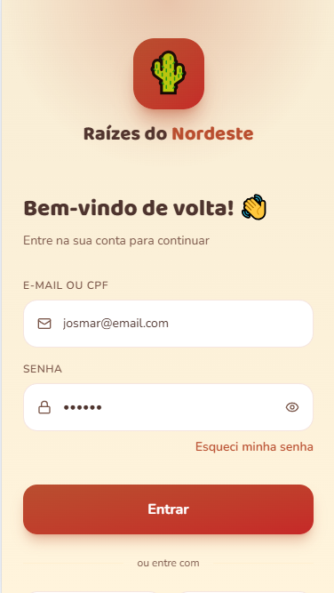

# 🌵 Raízes do Nordeste

<p align="center">
  
</p>

Aplicação web desenvolvida para simular a operação digital de um restaurante de comidas típicas nordestinas.

O objetivo do projeto foi criar uma experiência próxima de um aplicativo real, trabalhando conceitos de Front-End, organização de componentes, gerenciamento de estado e uma interface simples e intuitiva para diferentes tipos de usuários.

## 🚀 Demonstração

🌵 Acesse o projeto online:

https://josmar.github.io/raizes-do-nordeste


## 🥘 Funcionalidades

### Cliente

- Visualização do cardápio por categorias
- Detalhes dos produtos
- Montagem do carrinho
- Aplicação de cupons
- Acompanhamento de pedidos
- Programa de fidelidade com pontos e resgate de benefícios


### Gestão

- Painel do atendente para controle dos pedidos
- Painel do gerente com informações da operação
- Área administrativa para gerenciamento do sistema


## 💻 Tecnologias utilizadas

- React
- TypeScript
- Vite
- Tailwind CSS
- React Router


## 📂 Estrutura do projeto

O projeto foi organizado utilizando componentes reutilizáveis e separação de responsabilidades.

A estrutura conta com páginas independentes, componentes compartilhados e gerenciamento centralizado de estado para controlar informações como usuário, carrinho, pedidos e fidelidade.


## 🚀 Como executar

Clone o projeto e instale as dependências:

```bash
npm install
```

Execute o ambiente de desenvolvimento:

```bash
npm run dev
```

Depois acesse o endereço exibido no navegador.

## 📌 Sobre o projeto

Projeto desenvolvido como parte dos estudos em Desenvolvimento Front-End, com foco em criar uma solução funcional, responsiva e próxima de uma aplicação utilizada no mercado.
